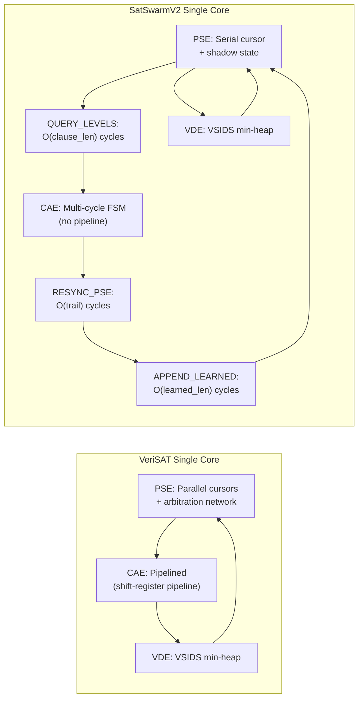
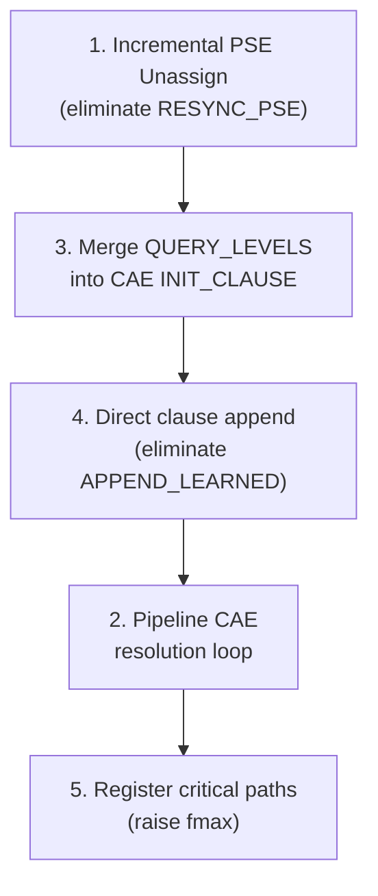

# SatSwarmV2 Single-Core Performance Improvements to Match VeriSAT

## Performance Discrepancy Summary

SatSwarmV2 1x1 takes ~~0.50ms per UF50 instance at 50 MHz; VeriSAT takes ~0.26ms at 150 MHz. Though SatSwarmV2 uses **fewer raw cycles** (~~24,772 vs ~39,240), it runs at 1/3 the clock, making it ~2x slower in wall-clock time. Closing the gap requires both **cycle reduction** and **frequency improvement**.




## Discrepancy 1: Resync Overhead (Biggest Impact)

**Current cost**: Every backtrack triggers RESYNC_PSE which replays the **entire trail** from index 0 to `trail_height - 1`, at 1 cycle per entry. For a 50-variable problem with ~40 assigned variables, that is ~40 wasted cycles **per conflict**. With hundreds of conflicts per problem, this dominates.

**Root cause**: PSE keeps a **shadow** `assign_state[0:MAX_VARS-1]` array (line 90 of [pse.sv](SatSwarmV2/src/Mega/pse.sv)). On backtrack, `solver_core` calls `pse_clear_assignments` (line 858) which zeros **all** entries, then RESYNC_PSE must replay the surviving trail to rebuild the shadow.

**Why VeriSAT avoids it**: VeriSAT uses a **single shared assignment store** with **arbitration**; no shadow copy exists, so backtrack only updates one store.

### Fix: Incremental PSE Unassign

Instead of clear-all + replay, **incrementally unassign** only the variables above the backtrack level:

- **Step A**: Add `pse_unassign_var` interface to PSE: on each cycle, clear one `assign_state[var-1]` and `reason_clause[var]` entry.
- **Step B**: In `solver_core`, during BACKTRACK_PHASE, iterate the trail from `trail_height-1` down to the new truncation point, broadcasting `pse_unassign_var` for each entry. This takes O(vars_to_undo) cycles instead of O(trail_height).
- **Step C**: Remove the `pse_clear_assignments` call and the RESYNC_PSE state entirely from the normal backtrack path. Keep RESYNC_PSE only as a fallback for rare rescan/restart cases.

**Files**: [solver_core.sv](SatSwarmV2/src/Mega/solver_core.sv) (lines 1398-1410, 1558-1619), [pse.sv](SatSwarmV2/src/Mega/pse.sv) (lines 858-864, add new interface)

**Estimated savings**: ~50-80% of cycles spent in resync. For a typical conflict that backtracks 5-10 levels (undoing ~5-20 vars), cost drops from ~40 to ~5-20 cycles.

## Discrepancy 2: CAE is Sequential, Not Pipelined

**Current cost**: CAE processes one trail entry per cycle in FIND_RESOLVE (line 251 of [cae.sv](SatSwarmV2/src/Mega/cae.sv)), one reason literal per cycle in RESOLUTION, and one buffer entry per cycle in FINALIZE_SCAN. Total: ~20-50 cycles per conflict.

**VeriSAT approach**: Pipelined with **delayed shift registers**: literal retrieval (~~3 cycles), level check (~~2 cycles), visited mark (~1 cycle) are **overlapped**. One literal enters the pipeline every cycle after warmup.

### Fix: Pipeline the Resolution Loop

The resolution loop (CHECK_UIP → FIND_RESOLVE → FETCH_REASON → READ_REASON_LITS → RESOLUTION) processes literals one at a time. Pipeline it:

- **Step A**: Create a 3-stage pipeline in FIND_RESOLVE:
  - Stage 1: Present `trail_read_idx` to trail_manager
  - Stage 2: Receive `trail_read_var`, `trail_read_level`; check `seen_q`
  - Stage 3: If match, latch `resolve_var` and transition to FETCH_REASON
  With this, the trail is scanned at **1 trail entry per cycle with 3-cycle latency** (same throughput, but pipeline allows overlapping with reason fetch).
- **Step B**: Pipeline reason clause reading: overlap FETCH_REASON and READ_REASON_LITS so the clause length is fetched while the first literal address is already being computed.
- **Step C**: In RESOLUTION, overlap literal insertion into the buffer with the next literal read (currently sequential: read lit, add to buffer, increment index, read next lit).

**Files**: [cae.sv](SatSwarmV2/src/Mega/cae.sv) (lines 251-330)

**Estimated savings**: ~30-40% reduction in CAE cycles. Trail scan stays 1 entry/cycle throughput but pipeline hides latency; reason reading overlaps.

## Discrepancy 3: QUERY_CONFLICT_LEVELS is Unnecessary

**Current cost**: Before starting CAE, solver_core spends `conflict_clause_len` cycles (typically 3-8) in QUERY_CONFLICT_LEVELS (line 1300 of [solver_core.sv](SatSwarmV2/src/Mega/solver_core.sv)), sequentially querying the trail for each conflict literal's decision level.

**VeriSAT approach**: No separate level-query phase; CAE reads levels **inline** from the trail during analysis.

### Fix: Move Level Queries into CAE's INIT_CLAUSE

- **Step A**: Pass the conflict clause directly to CAE (already done: `conflict_lits`, `conflict_len`).
- **Step B**: In CAE's INIT_CLAUSE (or a new INIT_LEVELS sub-state), query levels from the trail via `level_query_var` → `level_query_levels` (the interface already exists at lines 57-58 of [cae.sv](SatSwarmV2/src/Mega/cae.sv)). Do one query per cycle within the CAE.
- **Step C**: Remove QUERY_CONFLICT_LEVELS from solver_core. PSE_PHASE transitions directly to CONFLICT_ANALYSIS.

**Files**: [solver_core.sv](SatSwarmV2/src/Mega/solver_core.sv) (lines 1282, 1300-1339), [cae.sv](SatSwarmV2/src/Mega/cae.sv) (INIT_CLAUSE at line 160)

**Estimated savings**: Eliminates 3-8 cycles per conflict from the solver FSM. The same work is done inside CAE (no net cycle change for those queries) but removes one full state transition + one cycle of overhead.

## Discrepancy 4: APPEND_LEARNED / APPEND_PUSH Overhead

**Current cost**: After CAE, solver_core streams the learned clause into PSE one literal per cycle (APPEND_LEARNED, line 1409), then APPEND_PUSH adds 1-2 more cycles. Total: `learned_len + 2` cycles.

**VeriSAT approach**: CAE appends the clause **directly** to the clause database inside the module; no separate "streaming" phase from the top-level FSM.

### Fix: Let CAE Directly Append to Clause Store

- **Step A**: Give CAE a write port to the clause store / `lit_mem` in PSE. When CAE reaches FINALIZE_EMIT, it writes the learned clause directly into `lit_mem` and updates `clause_len`, `clause_start`, and watch lists.
- **Step B**: Remove APPEND_LEARNED and APPEND_PUSH from solver_core. After BACKTRACK_PHASE, go directly to unassign loop (from Discrepancy 1) and then PSE_PHASE.
- **Step C**: The asserting literal push to trail can happen in BACKTRACK_PHASE itself (1 cycle), eliminating the APPEND_PUSH state.

**Files**: [solver_core.sv](SatSwarmV2/src/Mega/solver_core.sv) (lines 1409-1536), [cae.sv](SatSwarmV2/src/Mega/cae.sv), [pse.sv](SatSwarmV2/src/Mega/pse.sv) (clause store write interface)

**Estimated savings**: Eliminates `learned_len + 2` cycles per conflict (typically 4-8 cycles).

## Build and Verification Plan

To ensure that performance improvements do not break solver correctness, it is critical to use `mega_sim.py` throughout the implementation process. 

### Instructions for `mega_sim.py`
Run `mega_sim.py` after each discrepancy fix to perform differential testing against the golden model.
```bash
python3 sim/mega_sim.py
```

### Divergences and their Indications
When verifying with `mega_sim.py`, track any divergences closely. Based on the modifications, divergences might look like:
- **Differing Learned Clauses:** Indicates an issue in the pipelined CAE (e.g., incorrect reason literal retrieval or improper UIP detection).
- **Mismatched Propagation Trail:** Likely caused by errors in the incremental PSE unassign logic, where variables are improperly cleared or retained.
- **Variable Decision Mismatches:** Suggests problems in how the trail state or conflicts affect the VDE (VSIDS heap), which could be a secondary effect of incorrect BCP or learned clause generation.

## Discrepancy 5: Clock Frequency (50 MHz vs 150 MHz)

**Root cause**: The original 489-level CAE path has been fixed, but the design still targets 50 MHz in simulation. The remaining critical paths may include:

- Wide `assign_state` array reads in PSE's `lit_truth_raw` function (line 211 of [pse.sv](SatSwarmV2/src/Mega/pse.sv))
- Combinational `trail_query` path through trail_manager's lookup tables (line 125 of trail_manager.sv)
- Watch-list linked-list traversal (combinational next-pointer chain)

### Fix: Register Critical Paths

- **Step A**: Register the output of `lit_truth_raw` — accept 1-cycle latency for truth queries in exchange for shorter combinational path.
- **Step B**: Register trail_manager query outputs (`query_valid`, `query_level`, `query_value`) and adjust solver_core to account for the 1-cycle delay.
- **Step C**: After Discrepancies 1-4, run Vivado synthesis targeting 125 MHz on VU47P; iterate on any new critical paths.

**Estimated impact**: Closing from 50 MHz to 100-125 MHz gives 2-2.5x wall-clock improvement on its own.

## Implementation Priority and Dependency Order



**Rationale**: Items 1, 3, 4 are targeted edits with large payoff and low risk. Item 2 is moderate effort. Item 5 handles the synthesis clock target after logic fixes are in place. Use `mega_sim.py` iteratively after each step.

## Expected Combined Impact


| Metric                         | Current (50 MHz)             | After fixes (est. 125 MHz) | VeriSAT (150 MHz)  |
| ------------------------------ | ---------------------------- | -------------------------- | ------------------ |
| Cycles per UF50 (avg)          | ~24,772                      | ~12,000-15,000 (est.)      | ~39,240            |
| Wall-clock per UF50            | ~0.50 ms                     | ~0.10-0.12 ms              | ~0.26 ms           |
| Cycles per conflict (overhead) | ~60-80 (resync+query+append) | ~10-15                     | ~15-20 (pipelined) |


With all fixes, SatSwarmV2 single-core should be **competitive with or faster than VeriSAT** in wall-clock time, while retaining the multicore scaling advantage.
