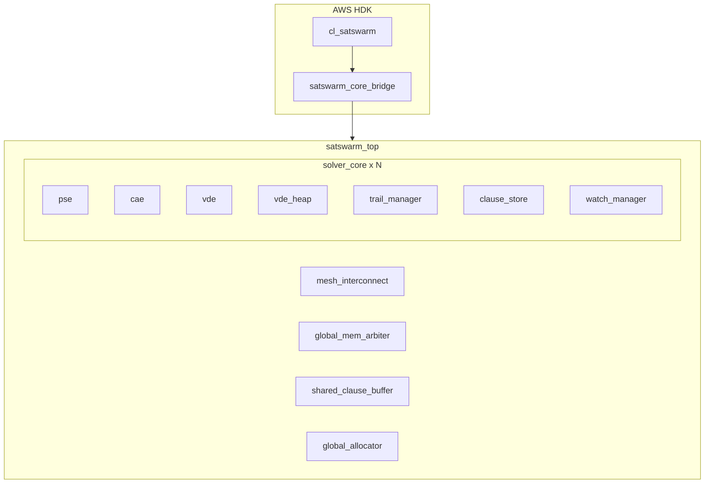

# SatSwarm Module Specifications

This directory contains detailed markdown guides for each RTL module in SatSwarmV2. Each spec documents the module's purpose, parameters, interface, internal structure, data flow, and **implementation highlights** (key design choices, timing/pipelining, memory inference, and algorithm details).

## Hierarchy

## CDCL Flow (VDE → PSE → CAE)

The solver operates in a **strict serial loop**:

1. **VDE (Variable Decision Engine)** — Selects next unassigned variable with highest activity score
2. **PSE (Propagation Search Engine)** — Performs Boolean Constraint Propagation (BCP) until stable or conflict
3. **CAE (Conflict Analysis Engine)** — On conflict: learns clause, computes backtrack level, triggers backtrack

Concurrency between these phases is **not** permitted; the solver_core FSM enforces strict alternation.

## Module Index

| Module | Spec | Role |
|--------|------|------|
| satswarmv2_pkg | [satswarmv2_pkg.md](satswarmv2_pkg.md) | Global parameters, types, structs |
| satswarm_top | [satswarm_top.md](satswarm_top.md) | Top-level solver grid integration |
| solver_core | [solver_core.md](solver_core.md) | Single CDCL core FSM |
| pse | [pse.md](pse.md) | Propagation Search Engine (BCP) |
| cae | [cae.md](cae.md) | Conflict Analysis Engine (First-UIP) |
| vde | [vde.md](vde.md) | Variable Decision Engine wrapper |
| vde_heap | [vde_heap.md](vde_heap.md) | Binary heap for VSIDS |
| trail_manager | [trail_manager.md](trail_manager.md) | Assignment trail + backtrack |
| clause_store | [clause_store.md](clause_store.md) | Clause metadata + literal storage |
| watch_manager | [watch_manager.md](watch_manager.md) | Two-watched-literal lists |
| shared_clause_buffer | [shared_clause_buffer.md](shared_clause_buffer.md) | Multi-core clause broadcast |
| global_allocator | [global_allocator.md](global_allocator.md) | DDR learned-clause address alloc |
| global_mem_arbiter | [global_mem_arbiter.md](global_mem_arbiter.md) | DDR read/write arbitration |
| mesh_interconnect | [mesh_interconnect.md](mesh_interconnect.md) | 2D NoC routing |
| interface_unit | [interface_unit.md](interface_unit.md) | NoC packet handler |
| cl_satswarm | [cl_satswarm.md](cl_satswarm.md) | AWS HDK CL top |
| satswarm_core_bridge | [satswarm_core_bridge.md](satswarm_core_bridge.md) | AXI/DMA to satswarm_top |
