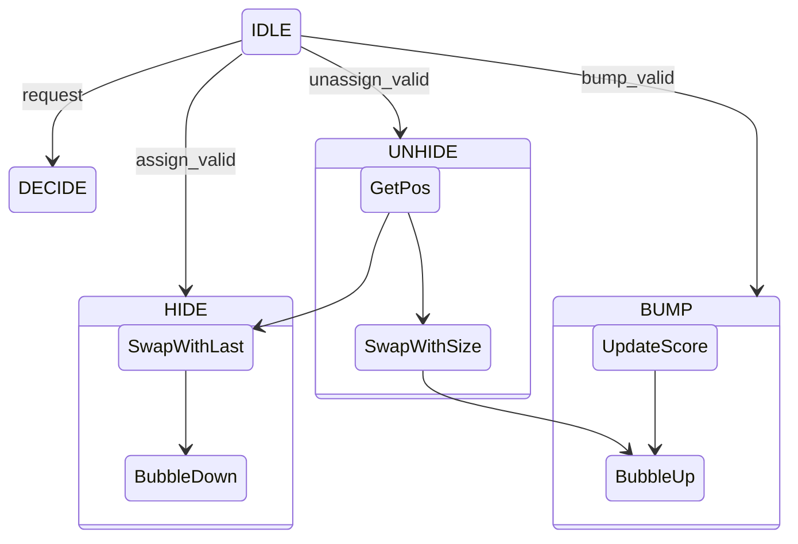

# VDE Binary Heap Specification

This document details the hardware specification for upgrading the Linear Scan VDE to a Binary Heap VDE, based on the `SatSwarm` HLS reference implementation.

## 1. Overview

The Variable Decision Engine (VDE) is responsible for selecting the unassigned variable with the highest activity score. The current O(N) linear scan implementation is inefficient for large variable counts. We will replace it with a Binary Heap (Priority Queue) implementation, allowing for O(log N) decision time and O(log N) updates.

## 2. Data Structures

The heap maintains the "Max-Heap" property based on variable activity scores.

### 2.1. Memory Units

To support the operations, we require two primary memory structures. We assume a fixed `MAX_VARS` capacity.

1.  **Heap Array (`heap_mem`)**
    *   **Content**: Stores `{activity_score, variable_id}` tuples.
    *   **Indexing**: Addressed by `heap_index` (0 to `heap_size - 1`).
    *   **Size**: `MAX_VARS` depth.
    *   **Width**: `64-bit Score + 32-bit ID`. (Note: We might optimize score bitwidth for FPGAs, but HLS uses doubles).

2.  **Position Map (`pos_mem`)**
    *   **Content**: Stores `heap_index`.
    *   **Indexing**: Addressed by `variable_id` (1 to `MAX_VARS`).
    *   **Size**: `MAX_VARS` depth.
    *   **Width**: `$clog2(MAX_VARS)` bits.

3.  **Heap Size Register (`heap_size`)**
    *   Tracks the number of valid (unassigned) variables in the heap.
    *   Assigned variables are "hidden" by swapping them to the region `[heap_size, MAX_VARS-1]`.

## 3. Operations

### 3.1. General Invariants
- `heap_mem[i].score >= heap_mem[2*i + 1].score` (if child exists)
- `heap_mem[i].score >= heap_mem[2*i + 2].score` (if child exists)
- `pos_mem[heap_mem[i].var_id] == i`

### 3.2. Initialize / Reset
- Fill `heap_mem` with variables `1..N` in order.
- Fill `pos_mem` with identity mapping.
- Set `heap_size = N`.
- Scores initialized to 0 (or seeded random).

### 3.3. Hide Variable (Assignment)
**Trigger**: When a variable is assigned (via `assign_valid`).
**Logic**:
1.  Lookup `idx = pos_mem[var]`.
2.  If `idx >= heap_size`, it is already hidden (should not happen if logic is correct).
3.  Decrement `heap_size`.
4.  Identify `last_idx = heap_size`.
5.  Swap `heap_mem[idx]` with `heap_mem[last_idx]`.
    - Update `pos_mem` for both variables.
6.  Since we moved the *last* element to `idx` (which might be the root or middle), it likely violates the heap property downwards.
7.  Perform **Bubble Down** from `idx`.

### 3.4. Unhide Variable (Backtrack)
**Trigger**: When a variable is unassigned (backtracking).
**Logic**:
1.  Lookup `idx = pos_mem[var]`.
2.  If `idx < heap_size`, it is already active.
3.  Let `target_idx = heap_size`.
4.  Swap `heap_mem[idx]` with `heap_mem[target_idx]`.
    - Update `pos_mem` for both variables.
5.  Increment `heap_size`.
6.  The unhidden variable is now at `target_idx` (a leaf). Its score might be high.
7.  Perform **Bubble Up** from `target_idx`.

### 3.5. Update Activity (Bump)
**Trigger**: Conflict analysis bumps a variable's score.
**Logic**:
1.  Lookup `idx = pos_mem[var]`.
2.  Read `score = heap_mem[idx].score`.
3.  `new_score = score + bump_val`.
4.  Write `heap_mem[idx].score = new_score`.
5.  If `idx < heap_size` (variable is active), Perform **Bubble Up** from `idx`.
    - Note: Even if hidden (assigned), we update the score, but we don't need to bubble up until it is unhidden. However, keeping the hidden region semi-sorted doesn't hurt, but the strict invariant is only for active region. The HLS code *only* updates scores. It seems it relies on `unhide` to restore order? No, `unhide` calls `swapHigher`. So lazy update is fine.

### 3.6. Decay & Rescale
**Concept**:
- **Monotonicity**: Multiplying all scores by a constant factor preserves their relative order (`a > b -> k*a > k*b`). Thus, decay/rescaling does **not** violate the heap property and requires **no reshuffling**.
- **Lazy Decay**: Instead of multiplying all `N` scores by `decay_factor < 1` (which takes O(N) cycles), we exponentially increase the `bump_value`.
    - `activity[v] += current_bump_val`
    - On decay event: `current_bump_val *= (1 / decay_factor)`
- **Rescale**:
    - **Trigger**: When `current_bump_val` exceeds a threshold (e.g., $10^{100}$ or max integer), preventing overflow.
    - **Logic**:
        1. Halt VDE.
        2. Iterate `i` from 0 to `heap_size-1`: `heap_mem[i].score *= small_const` (e.g., shifts).
        3. `current_bump_val *= small_const`.
        4. No heap swaps (`swapHigher`/`swapLower`) are needed because the order is preserved.

### 3.7. Decision (Extract Max)
**Trigger**: `request` signal.
**Logic**:
1.  Helper function: Check `heap_mem[0]`.
    - If `heap_size == 0`, `all_assigned = 1`.
2.  Return `heap_mem[0].var_id`.
    - Note: The decision logic *usually* returns the max and *assignments* (hiding) happens subsequently via the `assign_valid` interface. The VDE itself doesn't auto-pop. The Solver Core drives `assign_valid` which triggers the `Hide` op.

## 4. Hardware Implementation Specs

### 4.1. Module Interface
```systemverilog
module vde_heap #(
    parameter int MAX_VARS = 256,
    parameter int WIDTH_SCORE = 32 // Fixed point or float
)(
    input  logic         clk,
    input  logic         rst,

    // Decision Interface
    input  logic         request,
    output logic         valid,
    output logic [31:0]  var_out,
    output logic         phase_out,
    output logic         all_assigned,

    // Update Interface
    input  logic         assign_valid,
    input  logic [31:0]  assign_var, // Hides var

    input  logic         unassign_valid,
    input  logic [31:0]  unassign_var, // Unhides var

    input  logic         bump_valid,
    input  logic [31:0]  bump_var,
    input  logic [WIDTH_SCORE-1:0] bump_amt
);
```

### 4.2. FSM States


### 4.3. Bubble Up Logic
```
while (idx > 0) {
    parent = (idx - 1) / 2;
    if (heap[parent].score < heap[idx].score) {
        swap(idx, parent);
        idx = parent;
    } else {
        break;
    }
}
```

### 4.4. Bubble Down Logic
```
while (true) {
    left = 2*idx + 1;
    right = 2*idx + 2;
    largest = idx;

    if (left < size && heap[left].score > heap[largest].score)
        largest = left;
    if (right < size && heap[right].score > heap[largest].score)
        largest = right;

    if (largest != idx) {
        swap(idx, largest);
        idx = largest;
    } else {
        break;
    }
}
```

## 5. References
- VeriSAT HLS Implementation: `docs/reference/Full_HLS_impl/hls/src/priority_queue_functions.cpp`
